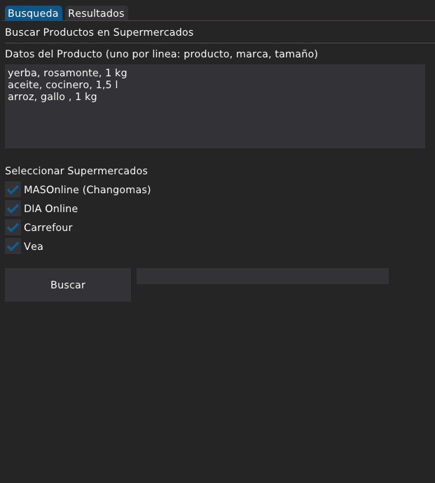
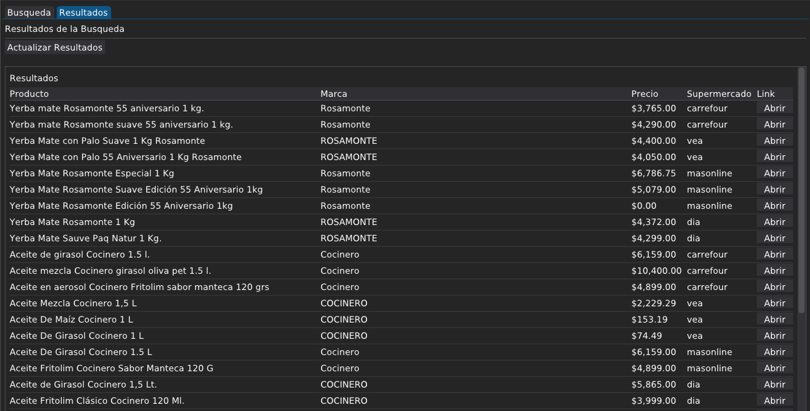
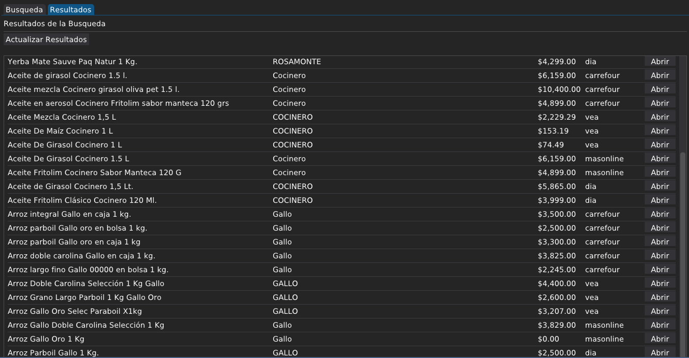

# Buscador de Precios de Supermercados


---

> ## Aviso Legal
> Este proyecto es para uso personal y educativo. Los precios mostrados son los publicados (por lo tanto públicos) por cada supermercado. Use responsablemente y verifique los Términos y Condiciones de cada sitio. Todas las marcas son propiedad de sus dueños de acuerdo a las leyes de copyright. Al contrario de lo que pueda deducirse a primera vista, el proyecto no desalienta la visita a los sitios web. Por el contrario, incluye enlaces directos a los productos mostrados en la tabla de resultados.

---

La Argentina viene de un pasado de alta inflación y está en un proceso de transición al libre mercado. Esto deriva en una diferencia, a veces marcada, de precio en el mismo producto según el comercio que lo ofrezca.

Generalmente, antes de una compra importante, y como creo aún hacen muchos, ingresaba a los sitios de los supermercados recorriendo pestañas del navegador, haciendo búsquedas y clicks en productos y registrando cada precio para luego comparar, lo que podía llevar varios minutos.

Por esa razón construí este proyecto en Python para buscar en segundos y comparar precios de productos en múltiples supermercados online (Changomas, DIA, Carrefour, Vea, etc.).

---

## Características

- Interfaz gráfica para buscar productos en varios supermercados a la vez
- Comparación de precios en una tabla interactiva
- Apertura directa de enlaces a los productos
- Exportación de resultados a JSON y CSV

---

## Requisitos

- Python 3.10+
- [Fish Shell](https://fishshell.com/) (para ejecutar el script)

---

## Instalación

```bash
# Clonar el repositorio
git clone https://github.com/gottigjavier/precios.git
cd supermercados
```

## Ejecutar Manualmente

```
# Crear entorno virtual
python3 -m venv venv

# Activar entorno virtual
source venv/bin/activate.fish  # o source venv/bin/activate en bash

# Instalar dependencias
pip install -r requirements.txt

# Instalar dependencias adicionales para la GUI
pip install dearpygui

# Ejecutar
./venv/bin/python main_gui.py
```

## Uso

Ejecutar el script `buscar.fish`:

```bash
./buscar.fish
```

Este script activa automáticamente el entorno virtual y lanza la interfaz gráfica.

---


## Capturas de Pantalla

### Pestaña Búsqueda



### Resultados





---

## Estructura del Proyecto

```
supermercados/
├── app.py              # Lógica de negocio
├── gui.py              # Funciones de carga de datos
├── main_gui.py         # Interfaz DearPyGUI
├── paths.py            # Rutas de archivos
├── buscar.fish        # Script de lanzamiento
├── requirements.txt  # Dependencias
├── supermercados.json   # Lista de supermercados
├── screenshots/     # Imágenes
└── venv/            # Entorno virtual (no incluido en git)
```

> Definir la lista de supermercados.
>
> La pantalla de búsqueda ofrece la oportunidad de elegir entre una lista de supermercados. Para ampliar la lista se debe agregar el supermercado al archivo *supermercados.json* respetando el formato JSON. Verificar que posea sitio web con las mismas características que los actuales.


---

## Tech Stack

- **GUI**: [DearPyGUI](https://github.com/PlainPython/dearpygui)
- **Scraping**: Beautiful Soup, Requests, lxml
